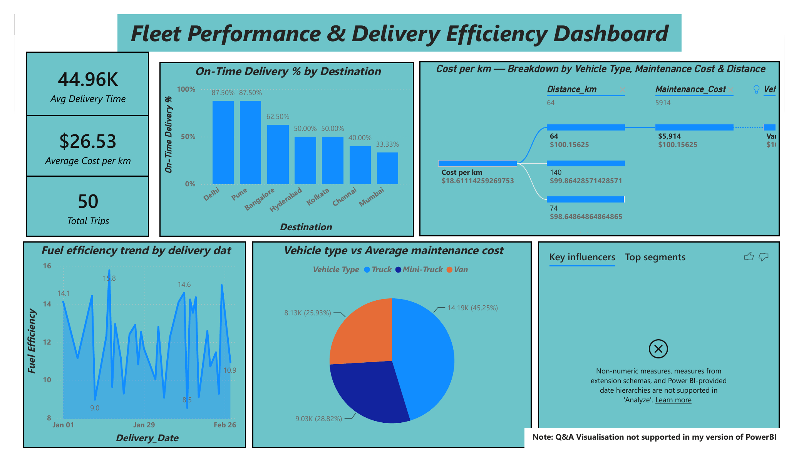
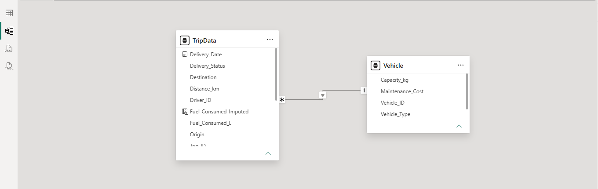

# Fleet Performance & Delivery Efficiency Dashboard

An AI-powered Power BI dashboard analyzing fleet performance, delivery efficiency, and cost across a logistics operation — built as a module-end portfolio project covering data cleaning, data modeling, DAX, standard visuals, and Power BI's AI visuals.

## Dashboard

## Data Model

One-to-many relationship between `TripData` and `Vehicle` on `Vehicle_ID`:

## Overview

A logistics company wants to understand how its fleet is performing in terms of on-time deliveries, fuel efficiency, and cost per mile. This project cleans and models trip-level and vehicle-level data, then builds a six-metric dashboard to surface performance patterns by destination, vehicle type, and delivery date.

## Dataset

- **Trip_Data**: Trip ID, Vehicle ID, Driver ID, Origin, Destination, Distance (km), Fuel Consumed (liters), Delivery Status (On-Time/Late), Delivery Date — 50 trips
- **Vehicle Master**: Vehicle ID, Vehicle Type, Capacity, Maintenance Cost — 7 vehicles

## What Was Done

### 1. Data Cleaning & Modeling
- Missing `Fuel_Consumed` values imputed using **vehicle-grouped mean imputation** (`AVERAGEIF` in Excel, and an equivalent DAX calculated column in Power BI).
- One-to-many relationship built between `TripData` and `Vehicle` on `Vehicle_ID`.

### 2. DAX Measures
| Measure | Formula |
|---|---|
| Fuel Efficiency | `DIVIDE(SUM(Distance_km), SUM(Fuel_Consumed_Imputed))` |
| On-Time Delivery % | `DIVIDE(CALCULATE(COUNTROWS(TripData), Delivery_Status="On-Time"), COUNTROWS(TripData))` |
| Cost per km | `DIVIDE(SUMX(fuel cost) + SUMX(RELATED(Maintenance_Cost)), SUM(Distance_km))`, fuel cost = ₹100/liter |
| Average Maintenance Cost | `AVERAGE(Vehicle[Maintenance_Cost])` |
| Total Trips | `COUNTROWS(TripData)` |

### 3. Visualizations
- Bar chart — On-Time Delivery % by Destination
- Line chart — Fuel Efficiency trend by Delivery Date
- KPI cards — Average Cost per km, Total Trips
- Pie chart — Vehicle Type vs Average Maintenance Cost

### 4. AI-Powered Visuals
- **Key Influencers** — configured with On-Time Delivery % as the analyzed measure and Distance_km / Vehicle_Type / Driver_ID as explain-by fields.
- **Decomposition Tree** — Cost per km broken down by Vehicle Type, Maintenance Cost, and Distance.

## Key Findings

- On-time delivery rate ranges from **87.5%** (Delhi, Pune) down to **33.3%** (Mumbai) — a wide spread across destinations.
- **Trucks** are the most expensive vehicle type per km (~$18.61), driven largely by maintenance cost and distance.
- Fleet-wide average cost per km is **$26.53**; Trucks account for **45.25%** of total maintenance spend.

## Known Limitations

- **Key Influencers returned no significant results.** Multiple configurations were tested (numeric measure as target, various explain-by field combinations, both Increase/Decrease directions), but the visual consistently reported "No influencers found." This is most likely due to the small sample size (50 trips) combined with an already high baseline on-time rate, rather than a setup error — documented here for transparency rather than omitted.
- **"Avg. Delivery Time" card was not implementable as specified.** The dataset only contains a single `Delivery_Date` field with no corresponding trip start/ship date, so no duration can be derived. Replaced with a **Total Trips** card as a meaningful alternative KPI.
- **Q&A visual is unavailable in this Power BI Desktop version.** The AI-visuals requirement was fulfilled instead using Key Influencers and Decomposition Tree.

## Tools Used

`Excel` (data cleaning, AVERAGEIF imputation) · `Power BI` (Power Query, data modeling, DAX, Key Influencers, Decomposition Tree)

## Repository Contents

- `Cleaned.xlsx` — cleaned source data (Excel)
- `ModuleEnd.pbix` — Power BI dashboard file
- `Fleet_Dashboard_Summary.pdf` — one-page project summary
- `images/` — dashboard and data model screenshots
- `README.md` — this file

Author: Srivatsan Saravanan, a Data Analystics Learner
